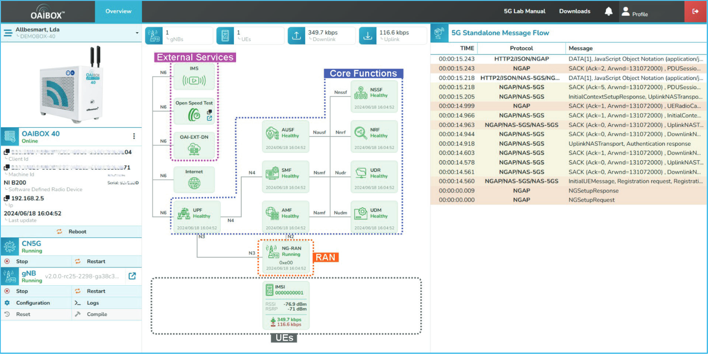
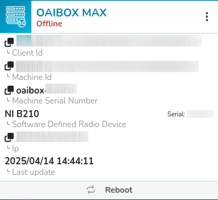
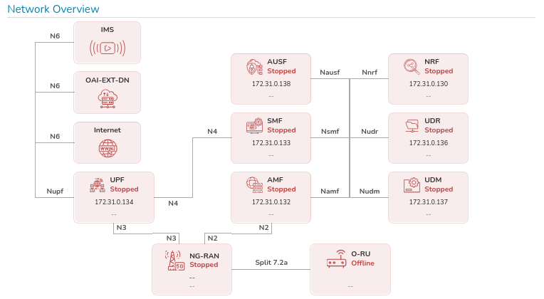
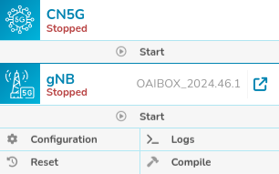
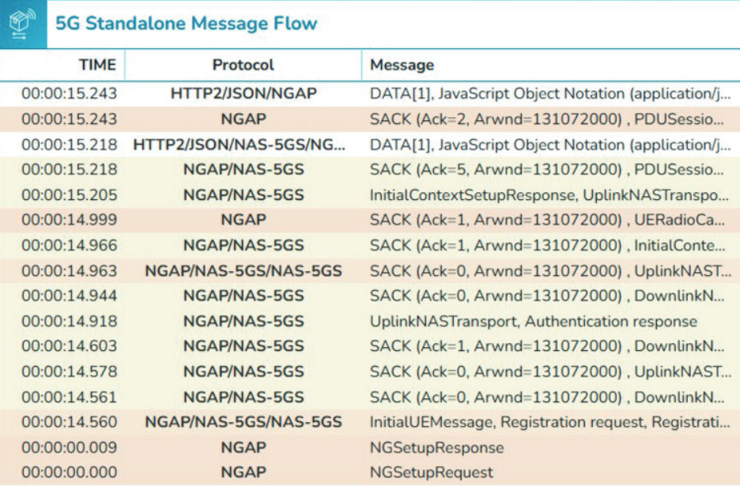
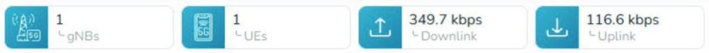
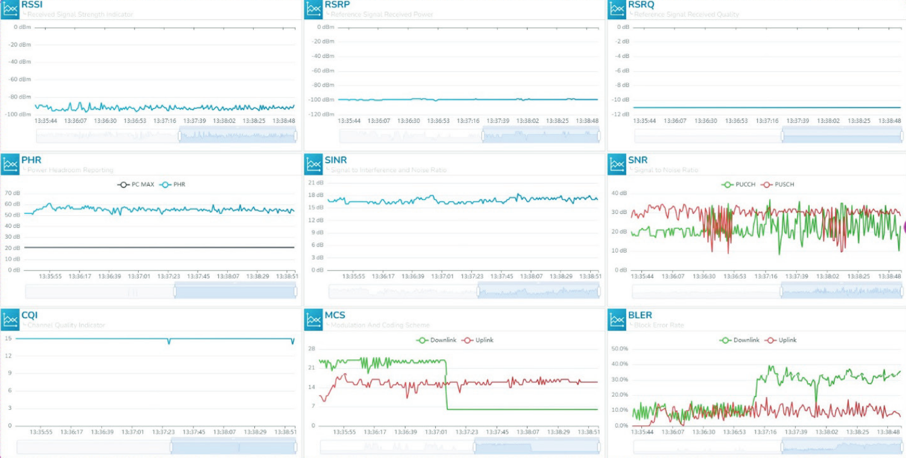
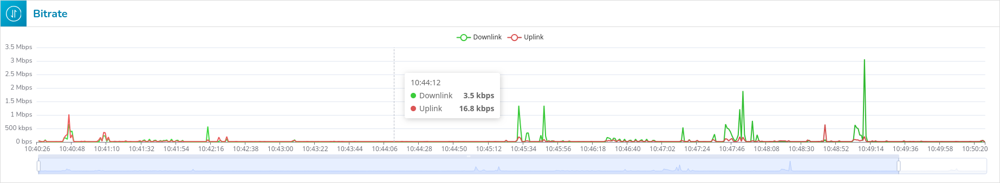

# Analysis of competitor

## General Overview  
The OAIBOX interface allows real-time visualization, machine control, network flow analysis, and the display of radio metrics in a standalone 5G environment.

---

## Machine Selection  
Allows the user to select which OAIBOX instance to display and control, if there are multiple.

---

## Displayed System Information  
Displays the machine name as well as its status (online or offline).  
It also shows the client identifier, machine identifier, serial number, and IP address, along with a **Reboot** button to restart the machine.

---

## Network Visualization  
Real-time graphical display of components and their internal connections.

- Represented components: `IMS`, `OAI-EXT-DN`, `UPF`, `NG-RAN`, `AMF`, `SMF`, `AUSF`, `NRF`, `UDR`, `UDM`, `O-RU`, `Internet`  
- Status (healthy / stopped) and IP address of each component

---

## Machine Control  
Action buttons for managing the selected machine.

- **CN5G** (5G Core Network):  
    - A **Start** button allows you to start the CN5G. Once the core network is launched, this button is replaced by **Restart** and **Stop**.  
- **gNB** (Next Generation Node B):  
    - **Start**: Start services  
    - **Stop**: Stop services  
    - **Logs**: Access system logs  
    - **Reset**: Reset configuration  
    - **Compilation**: Recompile services

---

## Message Flow  
Tab dedicated to the analysis of network exchanges.

Uses Wireshark to display the time, protocol used, and a short summary of the message.

---

## Network Status  
Real-time display of network activity.

- Number of base stations (gNBs)  
- Number of user equipments (UEs)  
- Downlink throughput (in bps)  
- Uplink throughput (in bps)

---

## Displayed Radio Metrics  
Technical indicators for evaluating signal quality.

  

- **RSSI**: Received Signal Strength Indicator  
- **RSRP**: Reference Signal Received Power  
- **RSRQ**: Reference Signal Received Quality  
- **PHR**: Power Headroom Reporting  
- **SINR**: Signal to Interference and Noise Ratio  
- **SNR**: Signal to Noise Ratio  
- **CQI**: Channel Quality Indicator  
- **MCS**: Modulation and Coding Scheme  
- **BLER**: Block Error Rate  
- **Bitrate**: Effective bit rate