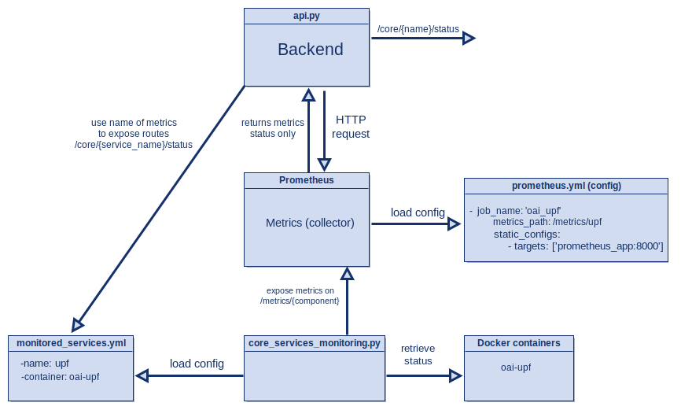

# Diagram of Container Status Metrics Collection

---

# Configuration of Monitored Services

We have a folder named `config` that contains two YAML files.

- The `monitored_services.yml` file defines each metric by specifying :

    - a `name`, which will be used in the URL route to access the metric, and

    - a `container`, which is the name of the corresponding Docker container to monitor.

- The `core_services_monitoring.py` script uses the container name to query (scrape) its current status using the Docker API, and uses the metric name to expose the status at a specific `/metrics/{name}` route.

- The `prometheus.yml` file defines Prometheus scrape jobs. It configures the routes that Prometheus will query in order to collect the metrics exposed by `core_services_monitoring.py`.

- The `monitored_services.yml` file is also used by the `api.py` script, which queries the metrics exposed by `core_services_monitoring.py` and provides a simplified API that returns only the status of each service at `/core/{name}/status`.
    
---

# How to add a metrics

To add a new metric in `monitored_services.yml`, you need to add :

- a `name`, which identifies the metric and is used in the API route, and

- a `container`, which must match the name of the Docker container you want to monitor.

To add a new metric in the `prometheus.yml` file, you need to define :

- a `job_name`, which is the name that will be displayed in Prometheus for this service.

- a `metrics_path`, which corresponds to the HTTP route where the metrics are exposed.

- a `targets` list, which contains the address and port of the service exposing the metrics (usually `core_status_api:8000` for this project).

Each job tells Prometheus what to scrape, where to find it, and how to label the collected data.

