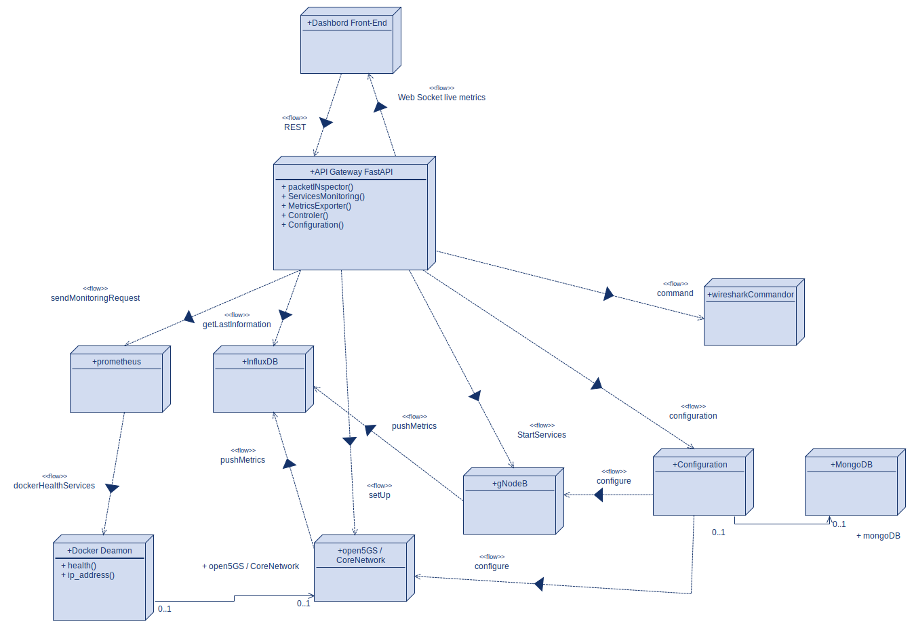

# OAI Dashboard Documentation

Welcome to the official documentation site for the **OAI Dashboard** — a web-based platform for managing OpenAirInterface and 5G test environments.

## Key Features

- Launch and monitor gNodeB and 5G Core
- View system metrics via Prometheus
- Manage VM-based simulations using OpenStack
- Control your lab from one clean UI

## Project overview 

## Get Started

- [Usage Guide](usage.md)
- [Intern Roadmap](intern-roadmap.md)
