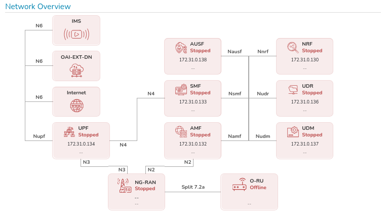
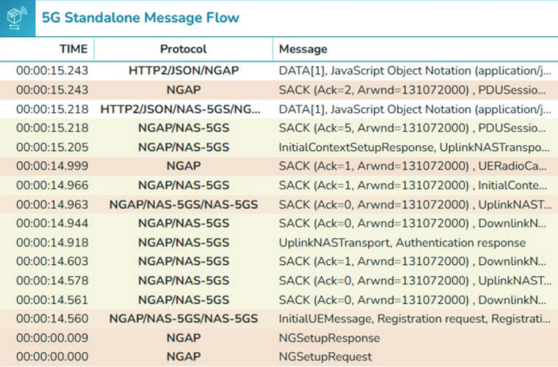
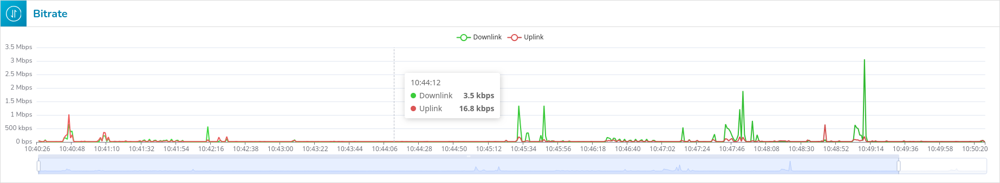

# Spécification

## Présentation générale
L’interface OAIBOX permet la visualisation en temps réel, le contrôle des machines, l’analyse des flux réseau et l’affichage de métriques radio dans un environnement 5G standalone.

---

## Sélection de la machine
Permet à l’utilisateur de sélectionner quelle instance d'OAIBOX afficher et contrôler, s’il y en a plusieurs.

---

## Informations système affichées
Affiche le nom de la machine ainsi que son statut (en ligne ou hors ligne).  
Elle présente également l'identifiant client, l'identifiant de la machine, son numéro de série et son adresse IP, ainsi qu’un bouton **Reboot** permettant de redémarrer la machine.

---

## Visualisation du réseau
Affichage graphique en temps réel des composants et de leurs connexions internes.

- Composants représentés : `IMS`, `OAI-EXT-DN`, `UPF`, `NG-RAN`, `AMF`, `SMF`, `AUSF`, `NRF`, `UDR`, `UDM`, `O-RU`, `Internet`
- Statut (actif / stoppé) et adresse IP de chaque composant

---

## Contrôle de la machine
Boutons d’action pour la gestion de la machine sélectionnée.  

- **CN5G** (Core Network 5G) :
    - Un bouton **Start** permet de démarrer le CN5G. Une fois le cœur de réseau lancé, ce bouton est remplacé par **Restart** et **Stop**.
- **gNB** (Next Generation Node B) :
    - **Start** : Démarrer les services
    - **Stop** : Arrêter les services
    - **Logs** : Accéder aux journaux système
    - **Reset** : Réinitialiser la configuration
    - **Compilation** : Recompiler les services

---

## Message Flow
Onglet dédié à l’analyse des échanges réseau.

Utilise Wireshark pour afficher le temps, le protocole utilisé ainsi qu’un court résumé du message.

---

## Network Status
Affichage en temps réel de l’activité réseau.

- Nombre de stations de base (gNBs)
- Nombre d’équipements utilisateurs (UEs)
- Débit descendant (Downlink) en bps
- Débit montant (Uplink) en bps

---

## Métriques radio affichées
Indicateurs techniques pour l’évaluation de la qualité du signal.

  

- **RSSI** : Received Signal Strength Indicator
- **RSRP** : Reference Signal Received Power
- **RSRQ** : Reference Signal Received Quality
- **PHR** : Power Headroom Reporting
- **SINR** : Signal to Interference and Noise Ratio
- **SNR** : Signal to Noise Ratio
- **CQI** : Channel Quality Indicator
- **MCS** : Modulation and Coding Scheme
- **BLER** : Block Error Rate
- **Bitrate** : Débit binaire effectif
